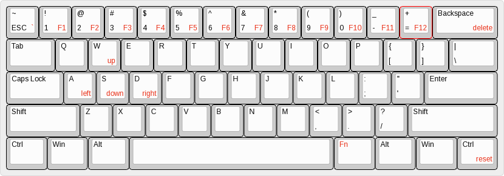

r60std keyboard firmware
========================

## Ugh

I didn't really want to carry around a fork of QMK, and I wanted the
firmware in this repo, but I did build this with QMK.

Get qmk from https://github.com/qmk/qmk_firwmare

rev1 boards:
------------

Check out rev 8a0997, link this directory as "r60std" in keyboards,
and then "make r60std/rev1:default" from the root of the qmk firmware
directory.  A r60std_rev1_default.hex should appear in the root of the qmk
directory.

rev3 boards:
------------

Check out rev 8a0997, link this directory as "r60std" in keyboards,
and then "make r60std/rev3:default_ansi" from the root of the qmk firmware
directory.  A r60std_rev1_default_ansi.hex should appear in the root of the qmk
directory.

The corresponding firmware for an ISO layout is "make r60std/rev3:default_iso".

## Layout

Default layout looks like this:

